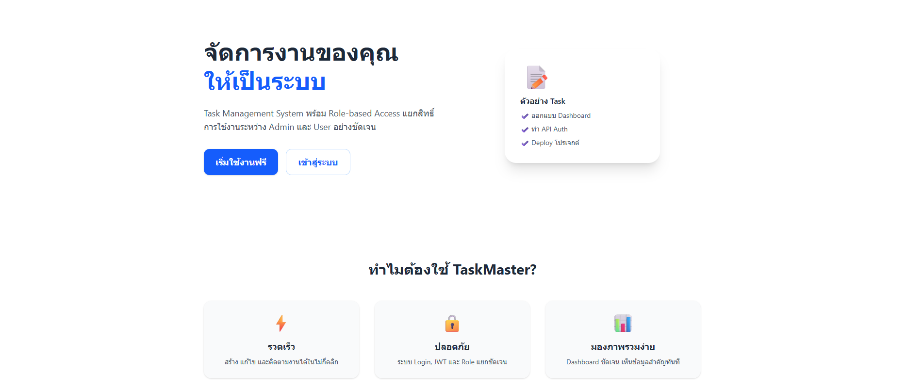
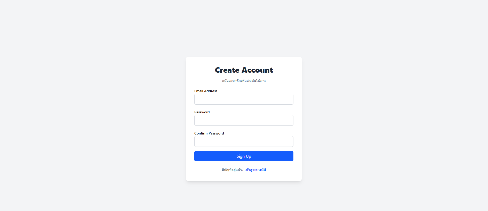
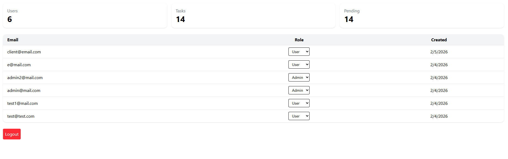
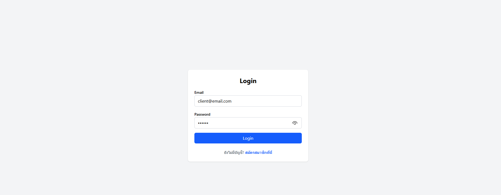
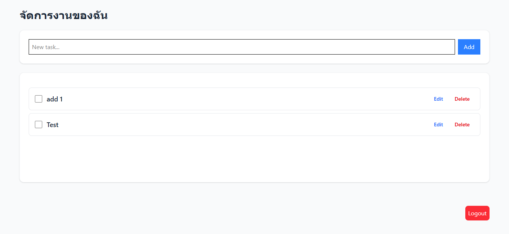

# User Management Live

A full-stack user management system built for learning and portfolio purposes.

## Tech Stack

- Frontend: React, TypeScript, Tailwind CSS
- Backend: Node.js, Express, TypeScript
- Auth: JWT
- Database: PostgreSQL

## Features

- Register / Login
- JWT Authentication
- Role-based access (user / admin)
- CRUD Tasks
- Protected Routes

## Getting Started

### Backend

```bash
cd server
npm install
npm run dev

```

### Frontend

```bash
cd client
npm install
npm run dev

```







